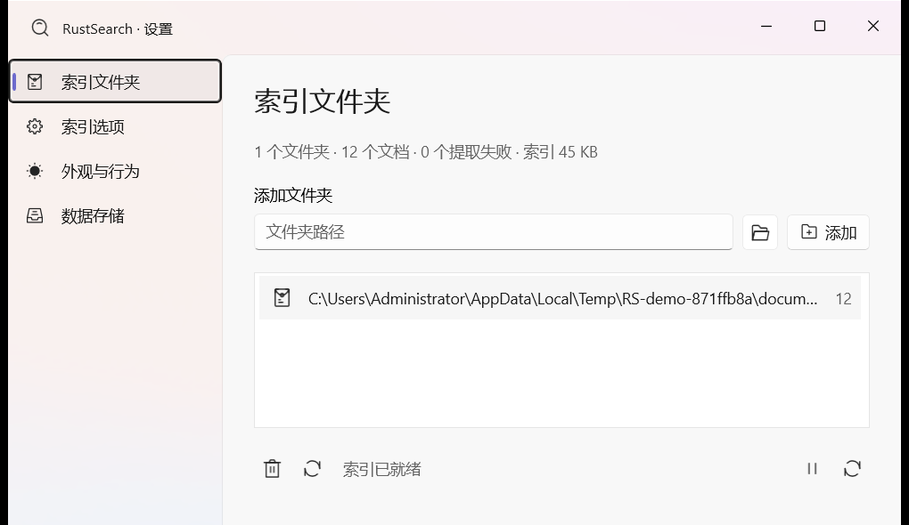
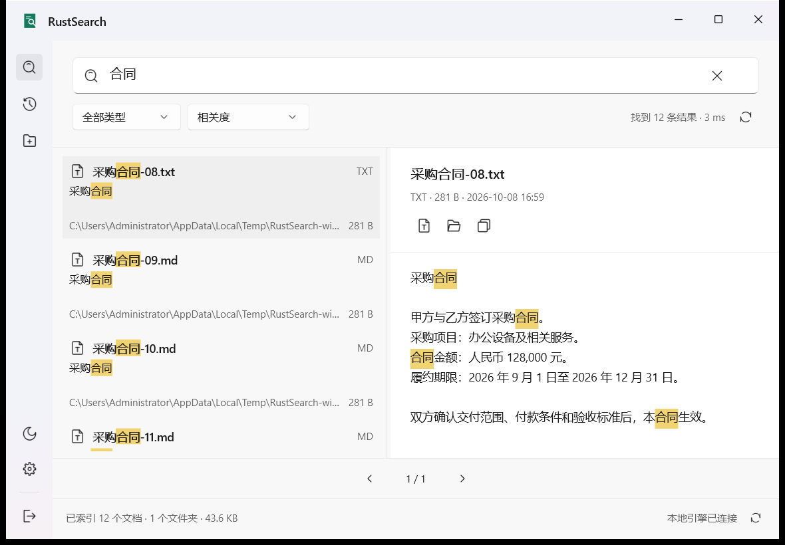
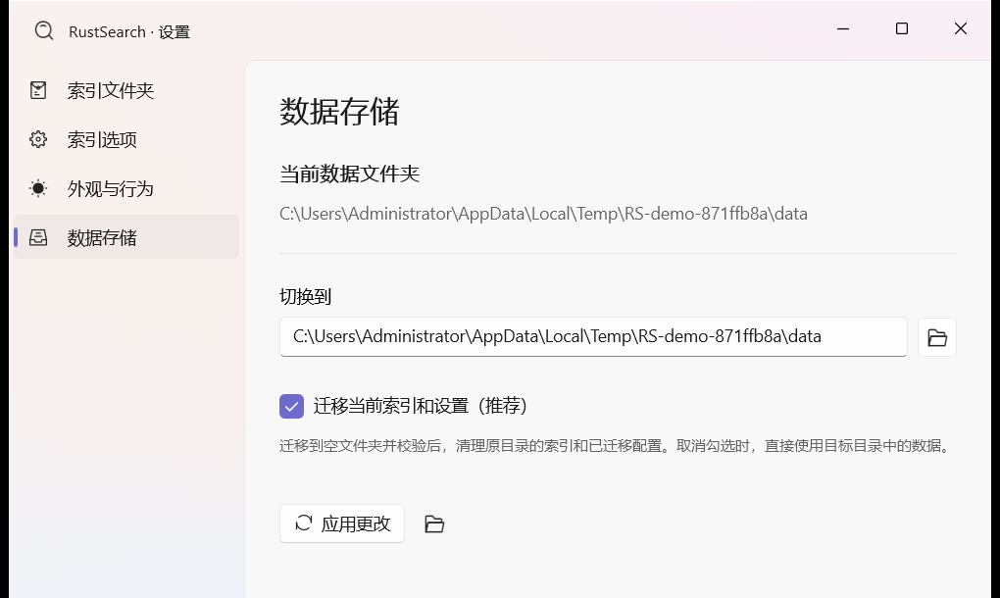
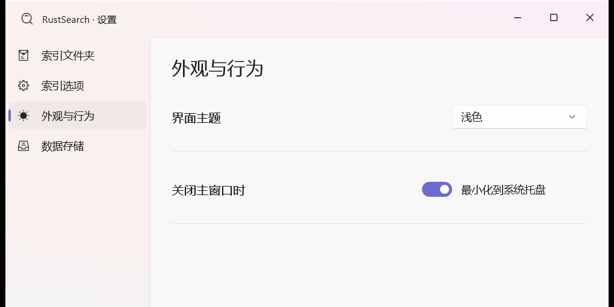

# RustSearch

[](https://github.com/Binghuai-Yan/RustSearch/actions/workflows/windows-release.yml)
[](LICENSE)

RustSearch 是完全本地运行的 Windows 全文搜索工具。WinUI 3 前端负责搜索、预览和设置；Rust sidecar 使用 Tantivy 建立索引，通过 stdin/stdout JSON Lines 与前端通信。文档和索引不会上传到服务器，程序运行时不需要联网。

## 下载

从 [Releases](https://github.com/Binghuai-Yan/RustSearch/releases/latest) 下载 Windows x64 版本：

- `RustSearch-<版本>-win-x64-setup.exe`：安装版，提供开始菜单、可选桌面快捷方式和卸载入口。
- `RustSearch-<版本>-win-x64.zip`：便携版，解压后运行 `RustSearch.WinUI.exe`。请保留完整目录，不能只复制 EXE。

微信输入法在当前 WinUI 3 文本框中可能只显示拼音预编辑文字而不弹出候选窗。这是 WinUI 对旧式第三方输入法辅助界面的兼容问题；普通 WinUI 文本框也受影响。安装版可从开始菜单打开 **RustSearch 输入法兼容界面**，便携版运行 `Compat\RustSearch.UI.exe`。兼容界面使用 WPF，微信输入法候选窗可正常显示，搜索与索引数据和 WinUI 版共用。切换界面前请完全退出另一个版本，避免同时打开同一索引。

微信输入法候选窗的[实测截图](https://github.com/Binghuai-Yan/RustSearch/blob/main/docs/screenshots/wechat-ime-compat.png)可单独查看。

Windows 10 1809 及以上版本、Windows 11 的 x64 桌面是目标平台。发布包包含 .NET 和 Windows App SDK 运行时。

## 首次使用

1. 启动后，点击主界面中间的“添加索引文件夹”，或点击左侧的文件夹加号图标。第一次打开时列表为空是正常的。

2. 在“索引文件夹”设置中，输入文件夹的完整路径，或点击路径框右侧的文件夹图标选择目录，再点击“添加”。建议先选一个常用文档目录；文件较多时可在这里看已索引文档数和进度。状态显示“索引已就绪”后即可搜索。需要更多目录时可以继续添加，不必等当前目录索引结束。移除目录只删除其搜索索引，不删除源文件。

   

   [单独查看索引文件夹截图](https://github.com/Binghuai-Yan/RustSearch/blob/main/docs/screenshots/index-folders.png)

3. 回到搜索页，在顶部输入文件名或正文关键词，结果会自动更新，无需按回车。可用下拉框筛选类型和排序；单击结果在右侧预览并高亮关键词，双击结果用系统默认程序打开。结果右键菜单和预览上方图标可打开文件、打开所在文件夹或复制路径。拖动结果与预览之间的竖线可以调整两侧宽度；底部分页用于查看更多结果。

   

   [单独查看搜索截图](https://github.com/Binghuai-Yan/RustSearch/blob/main/docs/screenshots/main-light.png)

4. 左下角齿轮打开设置。“外观与行为”可切换浅色/深色主题和关闭窗口后的行为；“数据存储”可迁移现有索引与设置。切换数据目录时选择目标文件夹，保留勾选的“迁移当前索引和设置”，再点击“应用更改”。新目录验证成功后会清理原目录中的索引和已迁移配置，其他文件会保留。

   

   [单独查看数据存储截图](https://github.com/Binghuai-Yan/RustSearch/blob/main/docs/screenshots/data-storage.png)

   

   [单独查看外观设置截图](https://github.com/Binghuai-Yan/RustSearch/blob/main/docs/screenshots/appearance.png)

5. 需要搜索图片或扫描 PDF 中的文字时，在“索引选项”开启“识别图片和扫描 PDF”，选择文件类型与单个 PDF 的页数上限，然后保存。普通索引先完成，OCR 在后台逐个处理；设置页显示待识别和失败数量，失败文件可手动重试。OCR 完成后重新搜索即可看到文字结果。识别完全在本机运行。[OCR 设计与验收](docs/ocr-design.md)说明处理流程和限制。

## 功能

- 中文和英文全文搜索，300 ms 防抖；文件类型筛选、相关度/时间/大小排序、分页及最近搜索历史。
- 文件名、搜索片段和正文预览高亮；可拖动分隔条调整结果与预览宽度。
- 添加、移除、重建索引目录，暂停/恢复索引，文件变化自动更新。后台索引期间保留当前搜索结果和选中项，手动刷新后展示新结果。
- 浅色与深色主题、可选托盘驻留、自定义分词词典、忽略目录和最大文件大小设置。深色界面见[截图](https://github.com/Binghuai-Yan/RustSearch/blob/main/docs/screenshots/main-dark.png)。
- 可迁移索引和设置到新的数据文件夹；验证成功后清理原目录中的已迁移数据。
- 可选离线 OCR：识别 PNG、JPEG、BMP、TIFF 图片及扫描/混合 PDF，按页记录 PDF 识别文字；OCR 期间不自动刷新当前搜索结果。

支持纯文本、Markdown、常见代码和配置文件、CSV、HTML、PDF、DOCX、XLSX/XLS/XLSB、PPTX、EPUB，以及 PNG/JPEG/BMP/TIFF 图片。文本编码包括 UTF-8、GBK/GB18030 和 UTF-16。默认跳过隐藏目录、`.gitignore` 忽略项、常见依赖/构建目录、Office 临时文件及超过 200 MB 的文件。OCR 默认关闭；开启后使用随包提供的 Tesseract 中英模型和 PDFium，无需联网。图片上不绘制识别框；手写体、复杂表格及旧版 `.doc`、`.ppt` 暂不支持。

搜索框支持以下语法：

| 示例 | 含义 |
| --- | --- |
| `合同 报价` | 匹配任一关键词 |
| `"采购合同"` | 精确短语 |
| `+合同 -过期` | 必含和排除词 |
| `合同 ext:pdf,docx` | 限定文件类型 |
| `size:>1mb` | 限定文件大小 |
| `date:>=2026-01-01` | 限定修改日期 |
| `path:C:\work\*` | 路径前缀 |

## 数据与卸载

默认数据目录是 `%LOCALAPPDATA%\RustSearch`，其中 `index/` 为 Tantivy 索引，`meta.db` 为 SQLite 元数据。设置中可更换数据目录并迁移现有索引。移除索引文件夹只删除对应搜索记录，不删除源文件。

安装版卸载时会询问是否删除当前用户的索引、元数据库和配置，默认保留。选择删除会清理 `index/`、`meta.db` 及其 SQLite 附属文件、配置、词典和界面偏好；数据目录中的其他文件会保留。静默卸载也默认保留；需要删除时显式传入 `/DELETEUSERINDEX`。

测试或独立部署可以设置 `RUSTSEARCH_DATA_DIR` 覆盖数据目录，使用 `RUSTSEARCH_PREFERENCES_DIR` 隔离保存目录选择的偏好。不要把个人索引数据加入源码仓库。

## 从源码构建

需要 Windows x64、PowerShell 7、Rust stable MSVC、Visual Studio C++ Build Tools 与 Windows SDK、.NET SDK 8 或更新版本，以及 Inno Setup 6。首次构建需要联网下载依赖。WinUI 自动化测试需要可交互的 Windows 桌面。

```powershell
./build.ps1
```

脚本准备固定版本的 Tesseract、PDFium 和中英模型并校验 SHA-256，运行 Rust 测试，发布自包含 WinUI 主程序和 WPF 输入法兼容界面，执行桌面回归测试，并生成 `dist/` 下的便携 ZIP 和安装 EXE。准备 OCR 运行时需要联网及 7-Zip，发布包使用时不需要联网。非交互环境使用 `./build.ps1 -SkipUITests`，仍运行 Rust 测试；只生成 ZIP 可加 `-SkipInstaller`。完整安装、启动、卸载验收可用 `./build.ps1 -TestInstaller`。

依赖缓存默认位于可用的 `E:\cache\RustSearch-Dependencies`，否则位于用户本地应用数据目录；也可用 `RUSTSEARCH_DEPENDENCY_CACHE_DIR` 指定。它与应用索引数据分离。单独执行 Cargo 或 dotnet 命令前，可运行 `. ./scripts/use-dependency-cache.ps1` 采用相同缓存路径。

GitHub Actions 在拉取请求中运行静态检查、Rust 测试及两个前端的编译；`main` 推送和手动触发时构建并上传 ZIP/EXE。推送 `v<版本>` 标签后，工作流使用 `docs/releases/v<版本>.md` 创建带详细更新记录的 GitHub Release，并附上两个安装包。CI 跳过需要交互桌面的 UI 测试，本地发布前应运行完整桌面和安装器验收。

发布新版本时，先同步更新 `VERSION`、`rustsearch-backend/Cargo.toml` 和 `Cargo.lock`，编写 `docs/releases/v<版本>.md`，完成本地验收，再推送同版本的标签。缺少详细更新记录或标签与 `VERSION` 不一致时，CI 会停止发布。[历史版本更新记录](docs/releases/v0.1.5.md)和[当前版本更新记录](docs/releases/v0.1.6.md)可在仓库查看。

## 架构与许可

- `RustSearch.WinUI/`：默认 WinUI 3 前端；`RustSearch.UI/`：微信输入法兼容前端及两者共用的服务代码。
- `rustsearch-backend/`：文件提取、Tantivy 索引、SQLite 元数据、监听及 JSON Lines 协议。
- `installer/`、`build.ps1`：Inno Setup 安装包与发行构建。

## 开源项目与许可

RustSearch 自有代码采用 [MIT License](LICENSE)。第三方组件保留各自的许可；下表列出项目直接使用的开源项目和构建工具。[完整第三方依赖清单](THIRD_PARTY_NOTICES.md)按锁定版本列出 309 个 Cargo 包和 20 个 NuGet 包，包括传递依赖、项目链接及其声明的许可。Windows App SDK 等 NuGet 二进制包的分发许可可能与源码许可不同，清单会标明包内许可文件。OCR 使用 [Tesseract](https://github.com/tesseract-ocr/tesseract)、[tessdata_fast](https://github.com/tesseract-ocr/tessdata_fast) 和 [PDFium binaries](https://github.com/bblanchon/pdfium-binaries)，许可文件随发布包存放在 `Backend/OCR/`。

| 前端、资源与发行工具 | 用途 | 许可 |
| --- | --- | --- |
| [Rust 工具链](https://github.com/rust-lang/rust) | 后端语言与构建工具 | MIT OR Apache-2.0 |
| [Windows App SDK / WinUI 3](https://github.com/microsoft/WindowsAppSDK) | 主界面 | 源码 MIT；NuGet 包另附 Microsoft 许可 |
| [.NET / WPF](https://github.com/dotnet/wpf) | .NET 8 运行时、备用 WPF 界面 | 源码 MIT；运行时包依其分发许可 |
| [CommunityToolkit.Mvvm](https://github.com/CommunityToolkit/dotnet) | WPF MVVM | MIT |
| [HandyControl](https://github.com/HandyOrg/HandyControl) | WPF 控件 | MIT |
| [Microsoft.Extensions.DependencyInjection](https://github.com/dotnet/runtime) | WPF 依赖注入 | MIT |
| [IconPark `@icon-park/svg`](https://github.com/bytedance/IconPark) | 随包提供的界面图标 | Apache-2.0；[原始许可文本](RustSearch.WinUI/Assets/IconPark/LICENSE) |
| [SQLite](https://www.sqlite.org/) | 元数据库，由 rusqlite 捆绑 | 公有领域 |
| [Inno Setup](https://jrsoftware.org/isinfo.php) | Windows 安装程序 | Inno Setup 自有许可 |

Rust 后端的直接 crate：

| 项目 | 用途 | 声明的许可 |
| --- | --- | --- |
| [Tantivy](https://github.com/quickwit-oss/tantivy) | 全文索引 | MIT |
| [tantivy-jieba](https://github.com/jiegec/tantivy-jieba) | Tantivy 中文分词 | MIT |
| [jieba-rs](https://github.com/messense/jieba-rs) | 中文词典与分词 | MIT |
| [rusqlite](https://github.com/rusqlite/rusqlite) | SQLite 接口 | MIT |
| [notify](https://github.com/notify-rs/notify) | 文件系统监听 | CC0-1.0 |
| [ignore](https://github.com/BurntSushi/ripgrep/tree/master/crates/ignore) | 目录遍历与忽略规则 | Unlicense OR MIT |
| [rayon](https://github.com/rayon-rs/rayon) | 并行处理 | MIT OR Apache-2.0 |
| [crossbeam-channel](https://github.com/crossbeam-rs/crossbeam) | 工作队列 | MIT OR Apache-2.0 |
| [calamine](https://github.com/tafia/calamine) | Excel 提取 | MIT |
| [lopdf](https://github.com/J-F-Liu/lopdf) | PDF 读取 | MIT |
| [pdf-extract](https://github.com/jrmuizel/pdf-extract) | PDF 文本提取 | MIT |
| [zip](https://github.com/zip-rs/zip) | Office/EPUB 容器 | MIT |
| [quick-xml](https://github.com/tafia/quick-xml) | Office XML 读取 | MIT |
| [scraper](https://github.com/causal-agent/scraper) | HTML 提取 | ISC |
| [encoding_rs](https://github.com/hsivonen/encoding_rs) | 文本解码 | (Apache-2.0 OR MIT) AND BSD-3-Clause |
| [chardetng](https://github.com/hsivonen/chardetng) | 文本编码检测 | Apache-2.0 OR MIT |
| [zstd](https://github.com/gyscos/zstd-rs) | 文本缓存压缩 | MIT |
| [regex](https://github.com/rust-lang/regex) | 查询与提取匹配 | MIT OR Apache-2.0 |
| [chrono](https://github.com/chronotope/chrono) | 日期解析 | MIT OR Apache-2.0 |
| [serde](https://github.com/serde-rs/serde) | 数据序列化 | MIT OR Apache-2.0 |
| [serde_json](https://github.com/serde-rs/json) | JSON Lines 协议 | MIT OR Apache-2.0 |
| [anyhow](https://github.com/dtolnay/anyhow) | 错误传播 | MIT OR Apache-2.0 |
| [tracing](https://github.com/tokio-rs/tracing) | 诊断日志 | MIT |
| [tracing-subscriber](https://github.com/tokio-rs/tracing) | 日志输出 | MIT |
| [tempfile](https://github.com/Stebalien/tempfile) | 临时文件 | MIT OR Apache-2.0 |

CI 使用的 [checkout](https://github.com/actions/checkout)、[cache](https://github.com/actions/cache)、[setup-dotnet](https://github.com/actions/setup-dotnet)、[upload-artifact](https://github.com/actions/upload-artifact)、[rust-toolchain](https://github.com/dtolnay/rust-toolchain) 和 [action-gh-release](https://github.com/softprops/action-gh-release) 均采用 MIT。工作流固定到声明使用 Node.js 24 的 action 版本。
